# ABC Campus Life Data Collector

## Versions
### v1.0.3 Hotfix
* Apks
    * [Debug](./debug/kaist.iclab.abc-v1.0.3-HotFix-debug.apk)
    * [Release](./release/kaist.iclab.abc-v1.0.3-HotFix-release.apk)
* Bug fixes
    * Crash when starting a collector without any data selected

### v1.0.3
* Apks
    * [Debug](./debug/kaist.iclab.abc-v1.0.3-debug.apk)
    * [Release](./release/kaist.iclab.abc-v1.0.3-release.apk)
* Changes
    * Workers are now handled only non-main thread (with JobIntentService)
    * Code refactoring 
* Settings
    * Survey will be triggered after 20 min. + 20 flex min. from the time when you are into a sedentary state.

### v1.0.2
* Apks
    * [Debug](./debug/kaist.iclab.abc-v1.0.2-debug.apk)
    * [Release](./release/kaist.iclab.abc-v1.0.2-release.apk)
* Changes
    * WiFi is not enabled if a user currently turns off WiFi. WiFi scanning is performed only when a user turn on WiFi.
    * Data traffic tracking is performed only when a screen is on. 
    * A user allows to select data that he/she want to provide.
    * Add UI for checking statuses of data collectors.
* Bug fixes
    * Not upload notification data
    * WiFi, Ambient Sound, and Location data automatically collected.
       

### v1.0.1-HotFix
* [Debug](./debug/kaist.iclab.abc-v1.0.1-debug.apk)
    * Fix: ESM scheduled time field is set to zero.
    * (Maybe) Fix: ESM interval is not properly work. 

### v1.0.1 
* [Debug](./debug/kaist.iclab.abc-v1.0.1-debug.apk)
* [Release](./release/kaist.iclab.abc-v1.0.1-release.apk)

## How-To

### 로그인 및 계정 생성
* 앱을 실행하게 되면 다음과 같은 로그인 화면이 나온다.

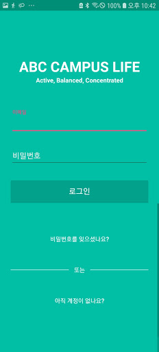
* 계정이 없다면 아래의 **아직 계정이 없나요** 를 선택하여 계정을 만든다.

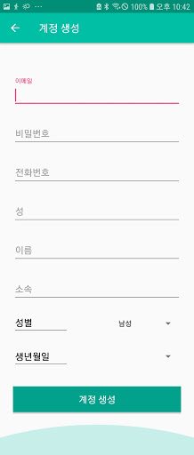
* 요구하는 정보를 입력한 후에 **계정 생성**을 선택하면, 아래의 인증 화면으로 넘어간다.

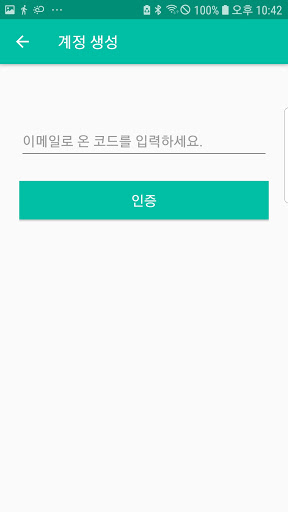
* 이메일로 전송된 코드를 입력하고 인증하게 되면 다시 로그인 화면으로 넘어가며, 방금 생성한 계정과 비밀번호로 로그인 한다.

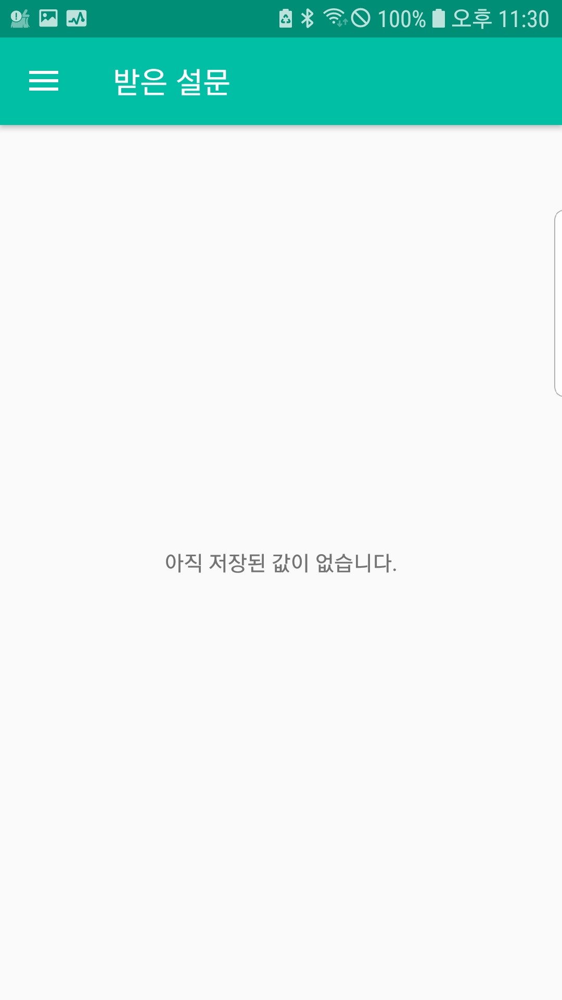
* 로그인 하게 되면 다음과 같은 메인 화면으로 넘어간다.

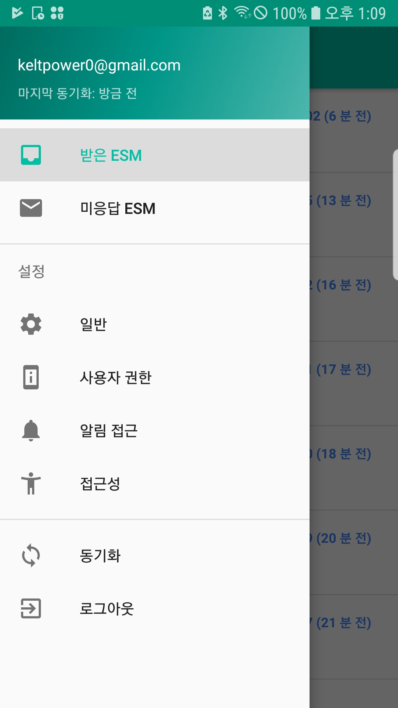
* 상단 툴바의 좌측에 있는 메뉴 버튼을 누르면, 이와 같은 메뉴를 볼 수 있다. 

### 설문/ESM 
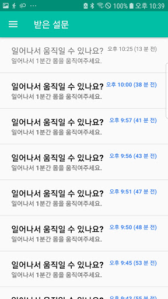
* **받은 설문(ESM)** 메뉴를 선택하게 되면 현재까지 받은 설문 목록을 확인할 수 있다. 
* **미응답 설문** 메뉴는 응답하지 않은 설문만을 필터하여 보여준다.
* 설문 목록 중, 진하게 표기되어 있는 항목은 아직 답장을 하지 않은 설문, 연하게 표기되어 있는 항목은 이미 답장을 완료한 항목이다.

* 항목을 선택하게 되면 이와 같이 설문 질문 목록이 뜨게 되며, 응답한 후에 우측 상단의 **저장** 아이콘을 눌러 저장한다. 
* **단, 설문은 한번 저장하게 되면 다시 수정이 불가능하다.**

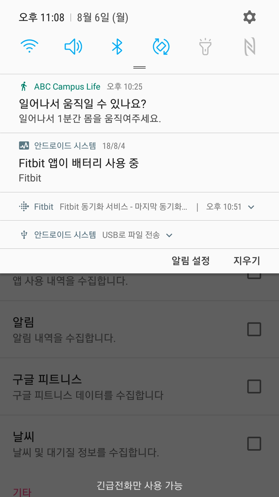
* 특정 조건을 만족하면 위처럼 알림이 도착한다.
* 해당 알림을 선택하면 아까 보았던 설문 질문 목록으로 들어가게 된다.

### 설정
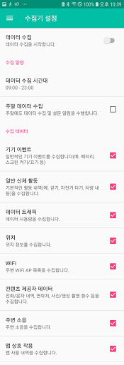
* 수집기 설정을 선택하게 되면, 위와 같이 수집기 On/Off, 수집 시간, 수집할 데이터 등을 설정할 수 있다.
* 수집할 데이터를 선택한 후에 수집기를 동작시키면 데이터 수집이 시작된다.
* 단, 아래서 설명할 **알림** 및 **앱 상호 작용** 항목은 추가적인 작업이 필요하다. 

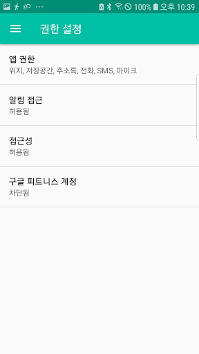
* 메뉴에서 **권한 설정** 항목에 들어가게 되면 현재 허용된 **앱 권한**과 **알림 접근** 및 **접근성** 허용 내역을 확인할 수 있다.

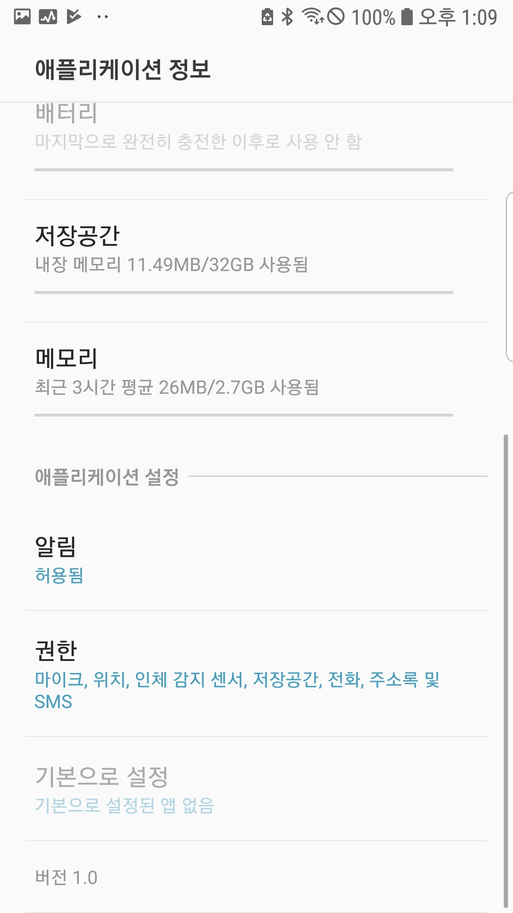
* **앱 권한**에 들어가게 되면 안드로이드 내장 설정 액티비티(SettingActivity)가 뜨게 된다. 이 중, **어플리케이션 설정** 항목에 있는 **알림**이 허용되어 있는지 꼭 확인해야한다.

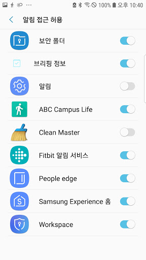
 * 다음 두번째 항목인 **알림 접근**을 선택하면, 위와 같은 알림 접근 허용 화면이 나온다.
 * 여기서 본 앱을 선택하여 알림 접근을 허용하도록 해야, 스마트폰에 도착하는 모든 알림 내역을 수집할 수 있다.
 
 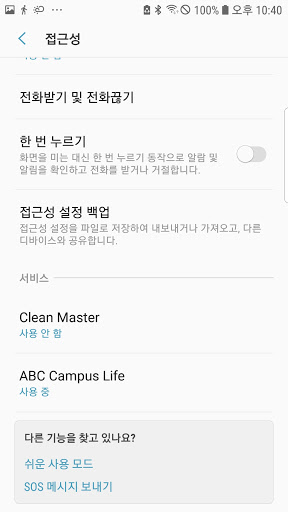
 * 마지막으로 **접근성**을 선택하면 접근성 설정 화면이 나온다.
 * 여기서 **서비스** 항목의 본 앱을 **사용 중**으로 전환해야, 스마트폰의 앱 사용 내역을 수집할 수 있다. 
 
 ## TODO
 * Collect Google Fitness data
 * Support any survey structure